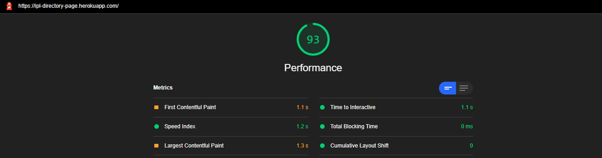

# IPL Directory Page

## Page Load Time

- Time to interactive: 1.3s (checked with Lighthouse)

  

## Optimization

Used react-visibility-sensor to only render components that are visible to the user hence cutting render time for invisible components.

- Before react-visibility-sensor: render time 170ms

  

- After react-visibility-sensor: render time 70ms

  
